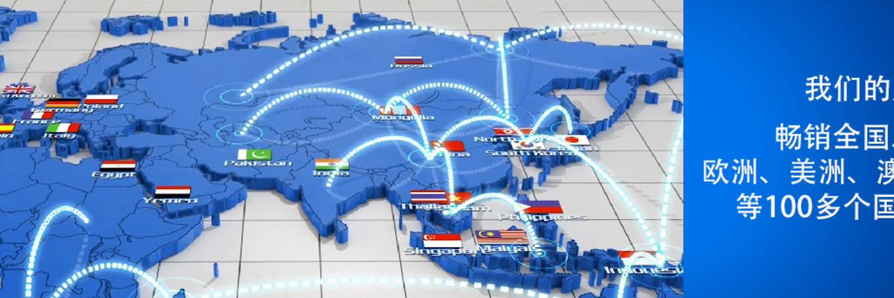

最近在思考如何简单有效的看透一个上市的估值问题。如果用PEG，也存在对过往op_yoy估算是否能持续的问题。其实还是对企业未来市场空间、竞争能力的估计问题。有的企业可以长期维持高速度的增长，有的企业只是在行业复苏的短时间，或者行业初期发展快速，待一段时间外部环境变化后就无法持续了。
这也是巴菲特为什么慎重投资**科技股**的原因之一。

我们来看看对凌霄泵业的一个简单战略和市场价值的分析，看看能否在5年内达到市场价值翻番的可能？

<!--more-->

## 一个5年的估值

今天尝试一下为凌霄泵业002884.SZ做一个粗略的五年估值。

| 年度   | 2021年 |   2022   |   2023   |   2024   |   2025   |    合计    | 备注          |
| :----- | :----: | :------: | :------: | :-------: | :-------: | :--------: | ------------- |
| 净利润 |  4.83  | 5.4（E） | 6.5（E） | 7.48（E） | 8.97（E） | 33.18（E） | 5年净利润翻倍 |

按现在15倍市盈率计算，市值应达到100亿元左右，比现在57.57亿元略微增长一倍。应该说长期看还是很不错了。关键这样的结果是非常稳定。

## 网友总结凌霄的优势

这是另一位网友发过来的：

> 初看凌霄泵业，总结出了企业相对同行业公司的几个优点和未来可能遇到的风险
>
> 1. 资产负债率低：资产负债率常年维持在9%左右属于轻资产，明显低于同类企业（大元泵业为20%左右）。
> 2. 毛利率稳定：销售毛利率在33%左右波动虽然近期有所下降（主要是大宗商品上涨过快，提价无法抵消大宗商品的上涨），但相对大元泵业一直维持着2%左右的优势。
> 3. 规模不断扩大：在2020年前，凌霄泵业的生产规模变化并不算大，处于稳步扩张阶段。而由于疫情的影响，不少的小微企业由于资金问题无法进行正常的生产，而凌霄泵业作为行业龙头借机扩张，抢占了不少市场份额，这也就是为什么在毛利下降不少的情况下公司依旧能保持稳定增长。
> 4. 费用控制良好：在营业收入和净利润稳步增长的同时，销售费用和管理费用并未出现大额的增长，即便在每年增加经销所的情况下，销售费用也能呈现下降的趋势，说明公司对于费用的管控能力优于同行业。
> 5. 负债干净：凌霄泵业不同于许多制造业的企业，其不依靠借贷经营，仅靠自身产生的现金流即可覆盖日常的经营活动和扩张行为，体现在资产负债表上为不存在短期借款和长期借款。
> 6. 股息稳定：每年凌霄泵业均会进行大比例的分红，在2020年股利支付率上升到了92.10%，而稳定的股息离不开公司稳定的经营，同时也是公司运转正常的有力凭证。
>
> 人无完人，同样，一家再优秀的企业也会存在着些许风险。而对于凌霄泵业来说也是一样。
>
> 短期来看，风险主要来自于规模的扩张。
>
> 2021年凌霄泵业业绩的增长是规模的扩张和市占率的提升冲淡了因大宗商品涨价导致的毛利下降，而对于2022年而言，市场基本出清，小企业的倒闭恐怕难以重演，因此规模的扩张和市占率的提升似乎很难像2021年般容易。但是，大宗商品的价格依然居高不下，在毛利率不变的情况下营业收入无法大额增长，那么企业的利润将会受到影响。
>
> 长期来看，泵这一行业低端产品内卷严重，要想发展只能是向中高端进军，而凌霄泵业也是这样做的，目前来看，进行的十分成功，但能否打破国外高端产品的垄断，创造出属于自己的壁垒未可知。当然这也需要我们进行长期的跟踪。

如果按照：**净利润=行业空间\*市占率\*净利润率**的维度来思考。

1. 考虑到凌霄现在的33.47%的毛利率不低，尤其是在一个无太大差异化的充分竞争市场。再考虑到其优秀到令人发指的期间费用率6.48%，2020年的净利率达到24.98%，固然优秀，同时未来也很难有提升空间。**这说明净利润率再很难提高**。
2. 整个泵的行业空间很大，到2024年接近4000亿的市场。然而国内的集中度很低，**凌霄只有3%左右的市占率**，这倒是凌霄的一个优势，未来推动业绩上行，主要是要依靠营收的上升，做到市占率的提升。

**问题来了**：如果要提升市占率，凌霄能依靠的到底是什么资源、核心能力并打败其他竞争对手呢？

是成本吗？是品牌吗？还是技术？或者说渠道呢？还是每样都比其他做的好一点点？

这个我们到它的2021年年度报告中去看看。

## 年报中的战略分析

### 核心竞争力

在2021年年度报告中去看看凌霄的管理层一共列举了四个核心竞争力，分别是

1. **技术研发优势**。公司经过40多年积累，坚持多年持续的研发投入，具有较为明显的技术优势：目前公司有20项专利，其中：7项发明专利，12项实用新型专利,1项外观设计专利。2021年度，公司有多项新产品投放市场，因其性价比高、产品质量稳定，赢得了市场的认可。公司在电机设计生产制造方面积累了的几十年的经验，具有电机设计制造、工艺稳定及成本控制方面的优势。
2. **品牌优势**。凌霄品牌经过三十多年沉淀积累，已成为备受推崇的知名品牌，在客户中具有“诚实、可靠、专业、经济、高效”的美誉度。市场上建立了具有忠诚度的、信赖度的客户群体。
3. **规模及标准化能力优势**。公司是国内小型民用电泵和工业配套电泵大型制造商，是塑料卫浴泵系列产品国内最大配套供应商之一。公司经过多年发展，形成了一套适合自身发展并具有特色的经营模式。扩大生产规模和推行产品标准化，使公司在原材料采购方面议价能力上掌握更多的主动权，摊薄制造成本，降低单位产品生产成本，从而增强公司的市场竞争力。
4. **高质量的客户资源优势**。公司坚持“以质量取胜，树品牌形象”宗旨，产品生产具有较高的工艺稳定性，同时对产品的原材料要求较高，制造的各类泵质量较好、安全耐用，很少有因为质量问题发生的纠纷。

从上面归纳的几个核心竞争力看，2022年到2025年，公司要扩大净利润，除了保持原有的生产、成本、研发优势，在泵业行业中最重要的还是提高市占率，首先是渠道拓展。这方面凌霄也在分析同行业的变化和客户的变化：

> 在年报中，凌霄分析道：2021年度，国内下游行业发展较为景气，需求逐渐集中化，一些小企业、小作坊因材料上涨困难重重，**订单向大型的规模化企业集中**，公司内销人员看准时机，以高性价比的产品切入市场，通过**上门推销、网络宣传**等方式，积极拓展客户群体，拓宽销售网络，把凌霄牌水泵的**品牌推广**到全国的主要城市，吸引更多客户订单，通过内销部门的努力，新老客户的订单不断增长。报告期内，公司国内销售继续推行**扁平化的销售策略**，以市场为中心，**技术服务型销售**，逐渐建立起更多的销售渠道，建立更多的有实力的销售窗口，和**直属办事处**，经销网络覆盖全国各主要城市。
>
> 针对国外市场，2021年度，随着各国下游行业生产恢复，**海外水泵市场需求增加**，但出口目的地国家供应链尚未完全恢复，公司稳定的生产能力使海外新老客户订单增加，公司外销人员在公司提价的压力和海运运输困难的情况下，加强与客户的交流，针对客户需求，**积极解决客户问题**，为公司争取了更多的出口订单。同时，**公司以价格、质量、规模、品牌优势**和全球卫浴、SPA行业**各大著名制造商的合作**，也在各行业中以线带面，**大力推广不锈钢泵产品**的应用，采用广告牌投入、专业性展会、派发产品说明书、其他媒介形式等方式宣传。还通过**线上线下相互结合**，网络推广软件等手段推广公司产品。在市场中形成了较好口碑，也逐步得到了同行业客户群体的认可，客户愿意和我们保持长期稳定的合作。本年度由于受疫情影响，销售人员通过线上参加相关展会，公司积极应对，通过网络或其他通讯方式与客户保持密切沟通，维护老客户的同时，拓展新客户。

总体来看，凌霄要在未来5年达到净利润翻番的目标还是可能的。即使原材料价格向上走，但市占率能从3%提高到10%，那也是相当可观了。如果市场再把这种收益的稳定性、管理的精良性考虑到市场中的估值中，那么凌霄的市场价值将大大得到提升。
