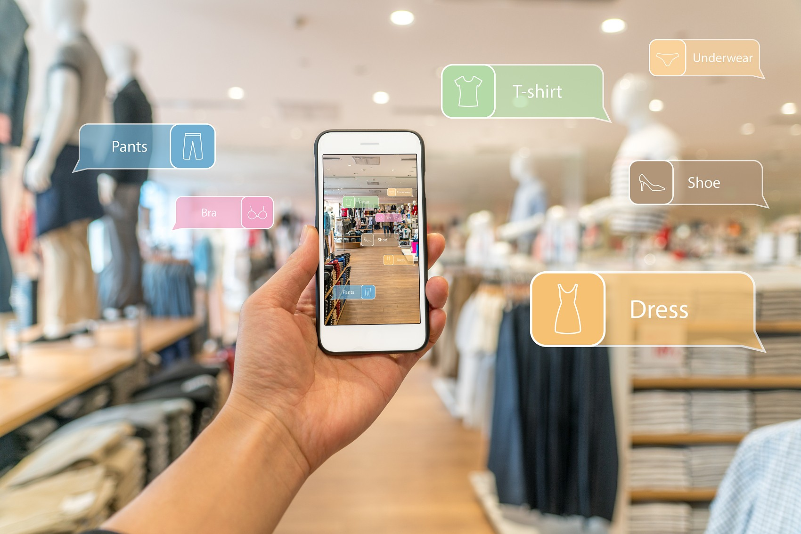

钱是不是财富？知识是不是财富？买的股票是不是财富？
很多人都有这样的疑惑，特别是对于30岁以上有一些房产、股票的中产阶级来说，更是焦虑。这些拿在手中的资产会不会化成水，哪一天醒过来没了。年轻人呢，还好，毕竟生活、工作才刚刚开始，本来也没有什么，两手空空，未来拼搏以后再考虑。

## 什么是财富
<!--more-->
常看见媒体上宣布"某某富豪有多少身家，坐拥多少财富"，比如"2021年巴菲特是拥有1040亿美元的全球第四大富豪"。我们普通人被问有多少财富时，首先想到的是"存款+房产价格+股票市值+车+……"，可能有很多朋友还有几个公司的股权。这些算不算，算！但财富的秘密和它的内涵还很是复杂，不能太简单化。否则，你不理"财"，"财"不理你。

> 公元前400年，古希腊思想家、史学家色诺芬在他的著作《经济论》中就写到**：财富就是具有实用价值的东西**。所以，那时候的财富就是人们常用的马、土地、粮食等有实际用途的东西。
> 后来就逐渐衍生出"财富就是货币，就是金银组成的"。
现代经济学家理解的财富定义是："**任何有市场价值，并可以用来交换货币或商品的东西都可以看作是财富**"。汉语《辞海》的解释是：具有价值的东西。
**财富问题变成了价值问题**。是的，你没看错，有价值的东西就是财富。但是价值又是什么呢？经济学上说的价值就是能满足人们欲望的能力。能满足人们欲望的东西就有价值。企业最大的功能就是创造价值，将原材料、人工、机器设备等组合在一起生产出满足顾客需求的产品或服务，这就是在创造价值。如果企业将这些组合起来生产出来的东西无法用高于它们成本的价格让顾客满意，那么这家企业就是在毁灭价值。所以**，企业或者说企业的股权算不算财富，是看它的产品或者服务能否满足顾客的需求。是否在创造价值，或者说创造价值的大小决定了拥有这家企业的股东，是否拥有这样的财富和拥有财富的多少**。
我们再问一个简单的问题，小明和小马工资都是5000元/月，但是小马的父亲是医生，小马一家人生个小病都不用看医生，直接到药店买合适的药，这一年一家4人可要省不少钱。呵呵，小马的父亲是医生对小马来说也是财富吧？那如果小张的父亲是老师呢？他们的财富是多少？
**人们经常都喜欢对比，所以为了对比，常常用货币价格来核算财富的程度**。比如，华为没有上市，持有华为股权的任正非拥有的财富是多少呢？好奇的人们有问题，就有专家针对问题找方法。华为每年的销售额或者净利润，我们就说净利润吧，拿出来和上市的主业类似公司的估值系数做个乘法，就得出了华为公司的市值。然后再和持有的股权比例相乘，就得出了拥有的这部分财富。

同样的，还有很多方法可以把人们持有的资产统统货币化衡量，最后人们就可以得到一个货币量化的财富总和了。这种思维对不对呢，总的来说可以这样做，但如果落实到自己具体的资产方面，我们还的认真考虑：**持有的这项资产究竟对我们普通人而言是否真的具有我们看到的有价值，他是否真的是一项财富**。为了说明这个问题，我们不妨试试举几个有趣但又常见的有价格，但不一定是财富的案例。

- 3年前100万元买入多少枚币，现在涨到了400万元。这400万元算不算财富。好像算，又好像不稳妥。这400万的某币在没有兑换成货币之前，真还不好说就是财富，因为它可能分分钟就被腰斩了。
- 持有某可能退市的股票和上面提到的持有某币一样，你可能心里也在一直打鼓，当然，有可能它还会上涨，涨到谁也看不懂的价格。
- 家里藏着的纸币（活期存款）。很多人说，这可以算是财富了吧。是的，没错这可以说是财富，但这样的财富是会缩水的财富，也许10年后它的价值就只有原来价值的三分之一甚至十分之一了。别还不信，2008年一二线城市1万的房价，现在应该到4万甚至更高了吧。

## 财富的大势

首先是看清社会发展的大势，无论是历史，还是对现实的分析，我们都可以找到未来财富分布的秘密。

### 城市的发展

未来的城市是什么样子的，我们究竟在一线北上广深，还是在二线城市杭州、成都、武汉等地生活工作。可能决定了我们未来财富的大小。无论是房产物业，还是未来的职业可持续性（我们财富的真正来源），或者是我们下一代的社会环境，和我们准备立足的城市都大有关系。

### 金融财富

金融财富，是指我们拥有的能在未来给我们带来价值的金融资产。

所以说，财富初看是一个时点数，仔细想想它又是一个无时无刻不在变化的东西。今天拥有的财富，未来不一定还有价值。假如我们在2000年买了1万台BP机，在当时还可以价值2000万元，放到现在是一分钱都不值了。因此，我们渴望能够拥有永久的财富是不存在的。社会经济发展最重要的一个定律不是竞争，似乎谁垄断什么就可以长久保有财富。我们买房投资，想的是这房子的地段好，未来还会升值。社会在发展，谁也不知道买到的房子所在的地段是否永远都是黄金地段。你把全世界的油田都买了，也不能保证财富都还存在。可能未来30年内全部都是用新能源了，风能、太阳能、核聚变，谁能说的准呢？

## 财富的可持续性

财富价值要想真正长久持续，一定要满足这几个条件：有价值的、稀缺的、难以替代的。

1. **有价值，代表我们拥有的财富是可以转换为以后其他的资产**。我们要记住的就是价值永远都是相对第三方而言的，你愿意用一万元买来的照片，可能对你特别有意义，但是对其他人毫无意义，别人不会花哪怕一元钱来买这张照片，这张照片就不具备价值，也不能称为是财富。所以，**财富一定是有价值的东西，而且我们要想财富可持续，那么他就必须持续有价值**。如果我们用这条标准考察所谓的各种币，哪怕花了上亿元，但它在未来能否还是一种财富，恐怕大家都要打上问号。
2. 稀缺的，代表这种资产在未来依然只是部分人能够获得，它的价值不会下降，甚至还在上升。比如如果我们能像巴菲特一样在20世纪80年代就拥有可口可乐的股票，在20年前就购入的北上广深核心地段的物业。时间在流逝，但**这些资产的稀缺性却没有改变**。我们现在持有的4、5线城市的房产呢？很遗憾，这些房产未来20年依然会有价值，但是它作为财富可能价值会大大缩水。
3. **难以替代性，这代表了我们拥有的财富的竞争力**。尽管未来依然有价值，也是稀缺的，但如果是很容易替代的资产，那么财富价值也会大大缩水。举个简单的例子，20年前车辆办个长途线路客运运输证价值十几万元，但是现在连普通的长途客车站都几乎要消失殆尽了。为什么？因为长途有高铁，大城市短途有地铁，家家户户都有小车了。再举个例子：我如果拥有3座加油站，这是很好的稀缺的，有价值的资产，现在是很有说服力的财富。但是我必须小心的是，要在长时间维度上看紧这笔财富，因为在可想的未来，人们都使用电动车了，可能加油站资产的价值就大大缩水了。在它的价值缩水之前，我必须想出好的方式，将这笔财富转换到其它资产上。所以，如果我们必须盯紧，让我们的财富处于难以替代的位置，它才能长期保值增值。

**所以，要想财富持久，就必须是持有上述特征的资产；或者盯紧社会、经济、科技的变化，让我们的资产跟上这些变化，如此财富才不至于缩水**。

## 不是结论的结论
其实说了这么多，最重要的是——真正的财富在我们的内心，不是还有一句话吗，财富分为两种**，一种是物质财富，还有一种是精神财富**。除了丰富我们的内心，我们物质财富的实际来源还是我们自身的能力，就像巴菲特说的一样在这个日新月异的世界："**最值得投资的实际是我们自己**"。无论是获取最初的物质资本，还是将物质财富保值增值都需要自己的成事能力、辨识能力、选择能力。

**也许口袋里的钱很少，但我们的内心很充实，知识很渊博，经历很有趣，谁说这又不是一种更能长远保存的财富呢**？