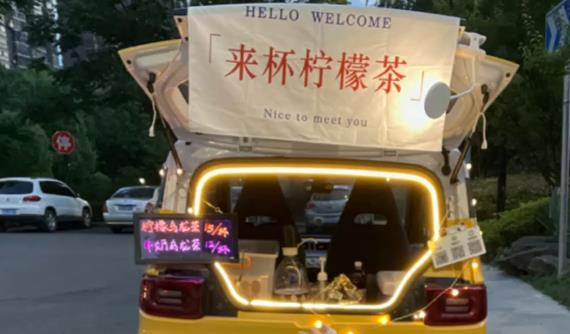

端午节的时候和一位小伙伴一起吃夜宵，谈到未来的工作、职业、潮流等问题时。朋友说他有一个项目考虑了很久，并且在家里开始小试手艺了。

**那就是**：**开一个移动的夜宵车**

<!--more-->

## 怎么做呢，有一个总体思路

1. 采购一辆电动小型货车，把后面改造成能一个小型厨房，然后晚上出来摆摊，主营业务是抄手、面条、卤菜和啤酒。我把它叫做**夜摊模式**。
2. 每个城市采购N台这样的改装车，用加盟且租赁的方式将这些车租赁给想摆摊的人群，每月收取租金。我称它为**租车模式**。
3. 制作配套的原料，分发给希望摆夜摊的加盟商。就把它叫作**工厂模式**。

目前考虑的大致有这几种模式。每一种模式其实都是可以成为一个很大的项目。由于大家都是第一次搞这种项目。所以，对每一种模式都必须全程参与并知晓其中的各个环节、成本、利润，痛点、痒点。对于后两种模式来说，第一种“夜摊模式”肯定是先行项目，只有自己先做一个或者参与了一个夜摊项目，才能说自己能不能做后两个项目。哪怕这个夜摊不是做抄手、卤菜，而是做的饮料、杂货，起码是能够明白在哪里可以摆摊，在哪里、什么时间、什么样的人群可以成为自己的顾客。所以，我们这里先分析一下第一种模式。

## 夜摊模式分析

实际上，进入21世纪20年代后，特别是在高房价、网络经济、疫情等冲击下，实体店实际上运营起来是非常难的了，尤其对于90、00后来说，没有多少积蓄，喜欢个性化的他们更渴望能够自由地、随性地个人化自己的职业。在这种情况下，移动式摊位车开始流行了起来，包括：各种饮料、酒、咖啡、小吃等。如果经常上小红书就可以发现，随处可见的网红摊位咖啡、饮料：15元的后备箱咖啡、10元的收工柠檬茶。而且只要有车，稍微改装一下就可以只用每天30元的车位费在人流量大的地方摆摊挣钱，很是契合了年轻人的随性、喜欢交流、讨厌一成不变的潮流。

在这种情况下，如果开发一个夜摊，差异化运营夜摊，是不是更好呢？这个问题可以分为几个方面：

> 一般来说，对一个准备进入的行业项目，如果不大的话并不需要正规的“PEST”，只需要专注于项目本身既可。夜摊几千年就有之，再加之是饮食行业，倒也不担心政策、经济、科技等冲击，只需要专注于在范围内如何满足周围人群的需求。当然，大环境还是需要自己做出判断的。
相对于“夜摊模式”，后面两种模式，就必须结合政策、经济、科技、社会环境等做出正确的全面的判断后再进行投入了。

我们首先是对顾客的分析，其次是整个业务环节的分析，然后是商业模式分析，最后是成本效益分析。

### 顾客市场分析

在这个项目中，我们首先要问问自己，发现了**什么样的顾客的什么需求**，而且这个需求是我们能够满足的。

朋友讲到了几个案例，一个是在峨眉山，经常和其他人一起吃夜抄手的案例，这个案例是在近十年前的四线小县城里看到并实际经历过的。二是在自己生活的城市，半夜许多娱乐场所出来的人们，经常还需要去吃蹄花、面条的人们。如果让我说，还可以加上半夜跑出租、代驾的人群。可能具体的时间段，能服务的顾客也是不一样的。
如果是在晚上6——9点，应该是上班回来的普通大众；如果是9点以后，可能是加班的、商场职员等；如果是10点以后，可能更多的是娱乐过后的年轻人居多；如果是在下半夜，可能是需要早起的，比如进货的人群等。每一个人群其实也跟着摆摊位置的不同而不同。
针对每个不同类型的顾客，需要采取不同的商业策略，我们可以在对商业模式分析时再具体讨论。

### 摆摊模式下的业务环节分析。

要摆一个夜摊，如同传统的摆摊，首先是营业点问题，需要一个可以摆摊的地方，另外需要一个收纳、制作的移动货车；其次是饮食原材料来源问题，可以自己制作，也可以买入别人的原材料然后自己加工；第三就是摆摊的时间安排，全天时间如何安排是合理的，可以实现收益最大化。

要把这个夜摊做好也不是一件容易的事情，我们对上面的几个要点逐一分析，并制订一个明确计划。

1. 摊点的问题。是固定还是移动，还是分时段不同，不同的顾客移动到不同地点。
2. 移动货车问题。车辆的大小、动力来源、价格、配件、维修保养、预算成本等，都决定了使用什么样的移动货车。
3. 饮食来源问题。抄手、面条、卤菜，是全部提供还是都备齐，主要原材料是自制还是采购，自制需要花多少时间、各自的价格和成本是多少。
4. 时间安排问题。这主要是看顾客对象，街面管理问题，自己的起居时间安排等。

### 商业模式分析

夜摊模式的商业模式分析粗看很好办，就是考虑简单的菜品采购、制作、摆摊、服务、收款。但是具体到不同的顾客，也需要采取不同的模式或者策略才能够更好的满足顾客的需求。比如：如果是加班的顾客，需要更方便的到达路径和就餐条件，吃完就走；如果经常是一群朋友过来的，需要的是更好口味的卤味和啤酒；如果顾客中游玩的人多，可能需要更好的嗮照片环境；如果是在凌晨，可能需要更大的份量。
总之，针对不同的顾客，需要不同的侧重点。

### 成本效益分析

成本效益财务分析，既重要又不重要。重要是因为我们的出发点是为了可持续发展业务，在为顾客服务的同时也提升自身的收入；说不重要，是因为如果我们把前面的各环节和关键点想清楚，分析透彻了，财务问题也自然就解决了。总之，收入只是整个项目产生的结果，它不是也不应该是整个项目的核心问题。

> 这里我们先做个简单测算：假如一台小型厢式货车的价格是7万元，加上其他的设备、证照、车辆保险等需要1万元，这相当于固定投入。每次出摊，人均消费15元，每次电、停车费等需要30元；假设毛利是70%。如果整个夜摊服务能达到100人，那么纯收入是1000元左右，应该算是可观了。
我们只考虑50人左右的量，每次出摊能够有500元纯收入，考虑一年有300天的出摊机会，一年收益还是不错，大概半年能够收回全部成本，半年后都是自己的收益。

无论如何，夜摊模式对一个想要靠自己的双手来奋斗的年轻人来说是可行的；对一个有时间和机会想做第二职业的个人来说也是一种可行的选择。当然，这一行当如果希望能日营业额达到1000元以上也会非常辛苦，毕竟是一个小本生意，不过真的可以尝试一下。无论实在上海、深圳还是长沙、武汉，抑或是在镇江、安庆，甚至是在最下面的县城，这都是一种生活和工作方式。愿每一位用双手在使劲干的朋友们都能干得好，干的高兴！
