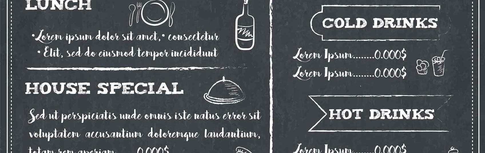

今天想总结一下自己在投资中的种种心理素质问题。前几个月看了《投资者的怪圈》（）、《行为金融学——洞察非理性投资心理和市场》（James Montier，英）、《思考，快与慢》（丹尼尔·卡尼曼），包括学习了得到中的《行为金融学》（陆蓉，上海财大）等书籍和教程。结合自己在实际投资中运用的的种种表现，看看是否在不知觉中实际也是这么像专家们说的，各种非理性呢。记录下来，好好看看。这篇主要是各种恐惧和信心。
从最近交易心情和情绪来看，这两种情绪占据了80%以上。似乎两种情绪不相关，甚至相反。但是正因为相反，反而突出表现了作为投资人的自己的种种非理性。不然怎么解释，上午还很有信心，下午大盘或者个股猛的下跌，就变得恐惧了呢？

<!--more-->
> 以昨天6月29日新洁能的走势为例：最开始的时候，小幅下跌3%，心理是恐惧的，担心再往下走。好不容易有20%的盈利了，别到最后没有实现，变成一场空欢喜。
但是到中午时段，它又回正了，还上涨了0.75%，这下心情又回暖了。感觉自己没卖出去是正确的。放放心心地出去吃饭，信心又恢复了。下午也没看就出门了，回来一看下跌了4.1%。一下有开始懊悔起来。一天整个人的心情都是随着价格的波动而波动。这样的状态真的能成功投资吗？
> 前一段时间，股市大好。我持有的10支股票都有了好的盈利，短期一个月实现12%的盈利。心理也就膨胀了，想的是能不能回家躺平了。其实自己还是明白，这是股市大盘所为，很大程度上不是自己的勤奋，更不是自己的聪明带来的。但是内心还是忍不住的膨胀，没办法。

你看，这就是经常盯盘的弊端。心情和股票价格的走势高度相关。
其实，正确的做法应该是向前看。就是你预期股票的价格走势，如果预期和实际走势符合，那就按计划办理和执行就好了。如果走势和预期不匹配，那就分析预期计划和实际走势的差异，究竟在哪里，是市场情绪还是公司问题？是短期问题还是长期问题？未来3个月、1年、3年究竟能不能实现真正的成长。

只有计划做好了，心里有数了，才不会被情绪所干扰，最后才能克服爆棚的信心和内心的恐惧。才不会被短期的市场走势所迷惑。
